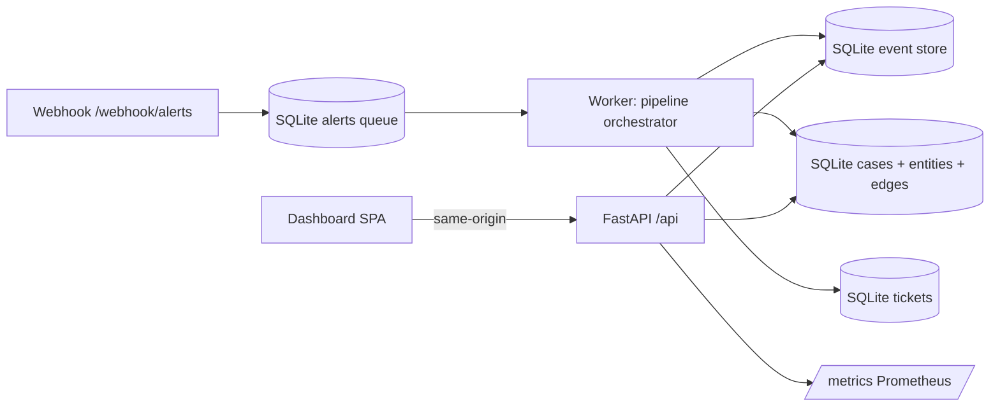

# AutoTriage: Cybersecurity Automation + SOAR Demo (Single Container)

**10-second pitch:** AutoTriage ingests noisy alerts, normalizes them, deduplicates and correlates into cases, enriches with deterministic offline datasets, scores + explains decisions, routes to a queue, and (optionally) “tickets” them — all with an append-only SQLite event store, replay experiments, Prometheus metrics, and a slick same-origin dashboard served from one FastAPI process.

## One URL demo (single container)

- FastAPI API: `/api/*`
- Prometheus: `/metrics`
- Webhook ingest: `/webhook/alerts`
- Dashboard SPA: `/` (static build served by FastAPI; no CORS)

Open: `http://localhost:8080`

## Quickstart (Docker)

```bash
make docker-build
make docker-run
```

Then open `http://localhost:8080`.

## Quickstart (Local dev)

```bash
make setup
make web-build
make run
```

In a second terminal:

```bash
python -m autotriage.cli.main ingest-file data/sample_alerts/vendor_a.jsonl
```

## Reproducible demo output

The demo is deterministic by default: it uses a fixed seed (`1337`) for the alert generator.

```bash
make demo
```

To reproduce the exact JSONL used by the demo (same seed + count):

```bash
python -m autotriage.cli.main tools alert-generator --seed 1337 --n 200 --out data/sample_alerts/generated.jsonl
```

## What this demonstrates

- **SOAR pipeline**: staged processing with an **append-only event store** and replay experiments
- **Idempotent ingestion**: safe webhook retries without duplicate processing
- **Dedup + correlation**: fingerprints, windows, entity overlap heuristics
- **Pluggable enrichment**: deterministic offline WHOIS/IP rep/GeoASN/allowlist/asset context with cache + rate limiting
- **Decisioning + explainability**: score contributions + routing rationale shown in the UI
- **Ops discipline**: typed code, tests, CI, Docker, Prometheus metrics, Make targets

## Known issues

- `web/` dev dependency advisory: `cd web && npm audit` reports a moderate `esbuild` issue fixable only by `npm audit fix --force` (Vite major upgrade). `npm audit --omit=dev` reports 0 vulnerabilities, and the production Docker image does not ship Node tooling.

## Architecture (Mermaid)



## API summary

- `GET /healthz`, `GET /readyz`, `GET /metrics`
- `POST /webhook/alerts` (vendor A/B/C shapes; returns 202)
- `GET /api/cases`, `GET /api/cases/{case_id}`
- `POST /api/replay`, `GET /api/experiments`, `GET /api/experiments/{experiment_id}`
- `GET /api/config`

## Replay experiments

Replays stored ingested events through the pipeline with config overrides, stores run summaries, and produces before/after diffs (ticket reduction, dedup reduction, decision distribution).

## Repo map

- `autotriage/autotriage/app`: FastAPI app, routes, middleware, static hosting
- `autotriage/autotriage/core`: models + normalize/fingerprint/dedup/correlate/scoring/routing/decisioning
- `autotriage/autotriage/enrichers`: offline enrichers + cache/rate limit/circuit breaker
- `autotriage/autotriage/storage`: SQLite migrations + repositories + aggregate views
- `autotriage/web`: Vite/React dashboard
- `autotriage/docs`: architecture, runbook, tuning, threat model

## Screenshots (placeholders)

- Overview: `docs/screenshots/overview.png`
- Case detail: `docs/screenshots/case_detail.png`
- Experiments: `docs/screenshots/experiments.png`

Capture via your OS screenshot tool once running at `http://localhost:8080`.

## Why it’s different

- **Event-sourced**: every stage is auditable and replayable (experiments are first-class)
- **Deterministic enrichments**: no external calls required; demo runs offline
- **Same-origin SPA**: one container, one URL, no CORS
- **Recruiter-friendly**: disciplined structure, typed code, tests, CI, Docker, runbook
